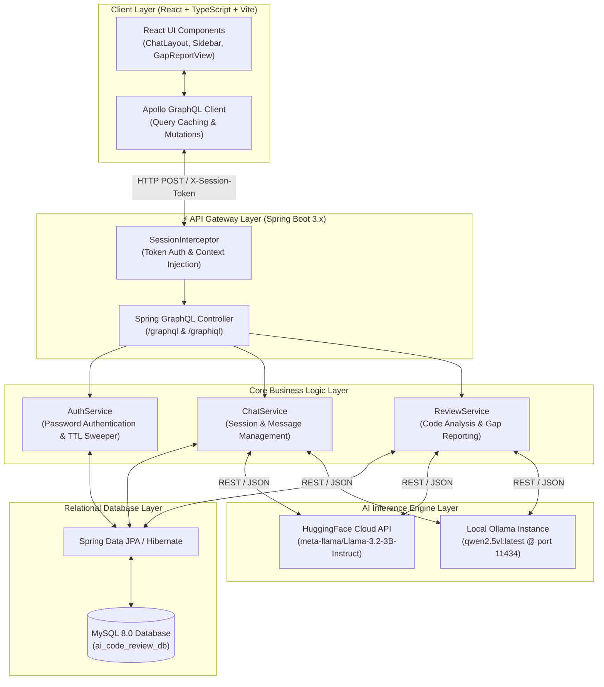
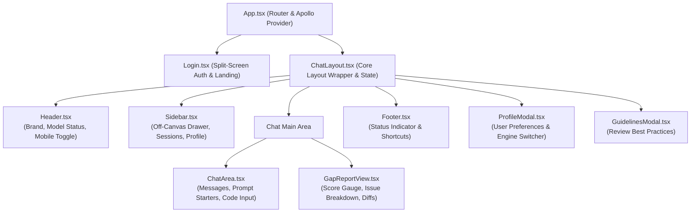
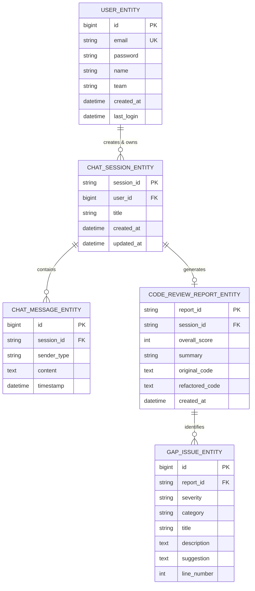

# AI Code Review Assistant - System Architecture & Technical Design

This document provides a comprehensive architectural overview of the **AI Code Review Assistant**. It details the high-level system design, backend modular layering, frontend component hierarchy, data models, authentication security flows, and AI inference integrations.

---

## 1. Executive Summary

The **AI Code Review Assistant** is an enterprise-grade, full-stack web application designed to empower developers with real-time, AI-driven code reviews, interactive refactoring discussions, and automated gap analysis reports. 

The system is engineered for **scalability, modularity, and responsiveness**:
- **Backend**: Built on **Spring Boot 3.x** and **Spring GraphQL**, providing a robust, type-safe API layer with automated database migrations via **Spring Data JPA / Hibernate** and MySQL 8.0.
- **Frontend**: Crafted with **React 18, TypeScript, and Vite**, utilizing **Apollo Client** for GraphQL data synchronization and a custom, responsive design token system (Vanilla CSS) that seamlessly adapts across mobile, tablet, and desktop viewports.
- **AI Inference Layer**: Features a dynamic multi-engine architecture capable of switching between cloud-based **HuggingFace Llama 3** models and offline, privacy-preserving **Ollama Vision** models.

---

## 2. High-Level System Architecture

The diagram below illustrates the end-to-end data flow and communication boundaries between the client browser, API gateway, core backend services, relational database, and external AI providers.



---

## 3. Backend Architecture (Spring Boot 3.x + GraphQL)

The backend follows a **domain-driven modular architecture**, where each functional domain is encapsulated within its own package containing its controllers, services, database repositories, and entities.

### 📦 Package & Module Breakdown

```
Team_B_Full_Stack_AI.ai_code_review_assistant
 ┣ 📂 auth/               # Authentication & Session Management
 ┃ ┣ 📂 controller/       # AuthController (GraphQL me, login, signup, logout)
 ┃ ┣ 📂 service/          # AuthService (Token caching, TTL expiration, background sweeper)
 ┃ ┣ 📂 interceptor/      # SessionInterceptor (HTTP header token extraction)
 ┃ ┗ 📂 exception/        # AuthExceptionHandler (GraphQL error mapping)
 ┣ 📂 chat/               # Interactive Chat & Session Handling
 ┃ ┣ 📂 controller/       # ChatController (GraphQL getSessions, getMessages, saveMessage)
 ┃ ┣ 📂 service/          # ChatService (LLM prompt orchestration, message persistence)
 ┃ ┣ 📂 entity/           # ChatSessionEntity, ChatMessageEntity
 ┃ ┗ 📂 repository/       # ChatSessionRepository, ChatMessageRepository
 ┣ 📂 review/             # Automated Code Review & Gap Analysis
 ┃ ┣ 📂 controller/       # ReviewController (GraphQL reviewCode, getGapReport, fixCode)
 ┃ ┣ 📂 service/          # ReviewService (Code parsing, vulnerability scoring, remediation)
 ┃ ┣ 📂 entity/           # CodeReviewReportEntity, GapIssueEntity
 ┃ ┗ 📂 dto/           [ChatService.java](ai-code-review-assistant/src/main/java/Team_B_Full_Stack_AI/ai_code_review_assistant/chat/service/ChatService.java)   # ReviewRequestDto, ReviewReportDto
 ┣ 📂 database/           # Shared Database Entities & Repositories
 ┃ ┣ 📂 entity/           # UserEntity (JPA table mapping with email & password)
 ┃ ┗ 📂 repository/       # UserRepository (findByEmail)
 ┣ 📂 dto/                # Shared GraphQL API Data Transfer Objects
 ┃ ┣ 📜 UserDto.java      # Front-facing user schema
 ┃ ┗ 📜 Session.java      # Auth payload wrapping token and UserDto
 ┗ 📂 config/             # Spring Boot Configuration & CORS Setup
```

### 🔐 Authentication & Session Security Flow
1. **Secure Password Authentication & Registration**: Users register new accounts via the `signup(name: String!, email: String!, password: String!)` mutation and authenticate via `login(email: String!, password: String!)`. User credentials are verified against the stored records in `UserEntity`.
2. **In-Memory Session Caching**: To prevent database bottlenecks during high-frequency GraphQL queries, active session tokens (`UUID`) are mapped in a thread-safe `ConcurrentHashMap<String, SessionDetails>`.
3. **Inactivity TTL Expiration**: Each session has a rolling **30-minute Time-To-Live (TTL)**. Every request processed resets the session's timestamp.
4. **Automated Background Sweeper**: A scheduled background thread (`@Scheduled`) wakes up every **1 minute** to sweep the in-memory map, purging expired tokens and reclaiming system memory.
5. **GraphQL Context Injection**: `SessionInterceptor` intercepts incoming HTTP requests, extracts headers (`X-Session-Token` or `Authorization`), validates the token against `AuthService`, and injects `"currentUser"` and `"currentToken"` directly into the GraphQL execution context.

---

## 4. Frontend Architecture (React 18 + TypeScript + Vite)

The frontend is architected for maximum component reusability, strict type safety, and responsive adaptability across all screen sizes.

###  Component Hierarchy & Routing



###  State Management & Data Synchronization
- **Apollo GraphQL Client**: Handles network communication with `http://localhost:8080/graphql`. It manages query caching, optimistic UI updates, and automatic cache refetching after mutations (e.g., refetching `GET_SESSIONS_QUERY` when a new chat session is created or deleted).
- **React LocalState & Context**: Local component state manages UI toggles (modal visibility, sidebar collapsed state, mobile drawer open/close).
- **Browser LocalStorage**: Persists essential user preferences across browser sessions:
  - `token` & `userId` & `userName`: Active authentication credentials.
  - `default-ai-model`: Selected AI review engine (`HUGGING_FACE` vs `OLLAMA`).
  - `sidebar-collapsed`: User preference for desktop sidebar expansion.

### Responsive Design System (Vanilla CSS Tokens)
The styling layer avoids bloated utility frameworks in favor of a clean, performant **Design Token System** defined in `index.css` via CSS Custom Properties:
- **Color Palettes**: Curated HSL dark-mode aesthetics, glassmorphism (`backdrop-filter: blur()`), and subtle glowing borders.
- **Adaptive Breakpoints**:
  - **Desktop (`> 1024px`)**: Full multi-column layout with split-screen login, persistent sidebar, and multi-column prompt starter cards.
  - **Tablet (`640px - 1023px`)**: Sidebar transitions into an **off-canvas drawer** triggered by a header hamburger menu with a dark backdrop overlay. Chat bubbles expand to 90% width.
  - **Mobile (`< 640px`)**: Single-column stacked layouts across all modals and report views. Chat bubbles expand to 96% width, code blocks enable horizontal touch scrolling (`-webkit-overflow-scrolling: touch`), and touch targets expand to at least `44px` height. On compact viewports (`< 480px`), the login illustration hides automatically to bring the form immediately into view.

---

## 5. Database Schema & Entity Relationships

The relational database (`MySQL 8.0`) manages user accounts, chat session histories, individual message transcripts, and structured code review gap reports.



---

## 6. GraphQL API Specification

The API contract is defined in `ai-code-review-assistant/src/main/resources/graphql/schema.graphqls`.

| Operation Type | Field Name | Arguments | Return Type | Description |
| :--- | :--- | :--- | :--- | :--- |
| **Query** | `me` | *None* | `User` | Returns the currently authenticated user based on `X-Session-Token`. |
| **Query** | `getSessions` | `userId: ID!` | `[ChatSession!]!` | Retrieves all historical code review sessions for a user. |
| **Query** | `getMessages` | `sessionId: ID!` | `[ChatMessage!]!` | Retrieves the conversation transcript for a specific chat session. |
| **Query** | `getGapReport` | `sessionId: ID!` | `GapReport` | Fetches a structured gap analysis report and refactoring score. |
| **Mutation** | `signup` | `name: String!, email: String!, password: String!` | `Session!` | Registers a new user account with a secure password and returns a session token. |
| **Mutation** | `login` | `email: String!, password: String!` | `Session!` | Authenticates an existing user and returns a 30-min TTL session token. |
| **Mutation** | `logout` | *None* | `Boolean!` | Revokes and destroys the active session token from memory cache. |
| **Mutation** | `createNewSession` | `userId: ID!, title: String!` | `ChatSession!` | Initializes a new code review conversation workspace. |
| **Mutation** | `deleteSession` | `sessionId: ID!` | `Boolean!` | Permanently deletes a review session and its associated messages. |
| **Mutation** | `saveMessage` | `sessionId: ID!, role: Role!, message: String!, model: AiModel, imageBase64: String` | `ChatMessage!` | Saves a prompt/message to the session transcript and returns the saved message. |
| **Mutation** | `reviewCode` | `sessionId: ID!, code: String!, language: String!, model: AiModel!` | `GapReport!` | Submits raw source code for deep static analysis and gap reporting. |
| **Mutation** | `fixCode` | `sessionId: ID!, model: AiModel!` | `String!` | Requests automated remediation and refactored code for identified gap issues. |

---

## 7. Deployment & Environment Configuration

### Backend Environment Variables
The Spring Boot backend can be dynamically configured using environment variables without modifying `application.yml`:
- `HUGGINGFACE_API_KEY`: Overrides the default HuggingFace API bearer token.
- `SPRING_DATASOURCE_URL`: Custom JDBC MySQL connection string (default: `jdbc:mysql://localhost:3306/ai_code_review_db`).
- `SPRING_DATASOURCE_USERNAME` / `SPRING_DATASOURCE_PASSWORD`: Database login credentials.

### Frontend Production Bundling
When building the frontend via `npm run build`, Vite bundles and tree-shakes the application into optimized static assets in `frontend/dist/`:
- **Code Splitting**: Separate chunks for vendor libraries (`React`, `Apollo`, `Lucide Icons`) and application logic.
- **Asset Optimization**: CSS minification and static asset hashing for optimal browser caching and CDN distribution.
